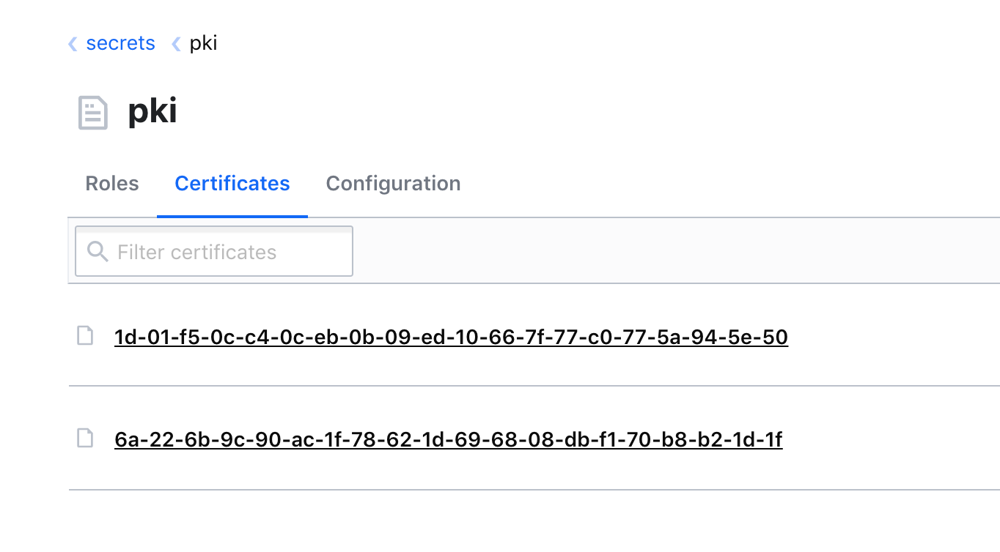

# Configure Vault as a Certificate Manager in Kubernetes with Helm

```bash
vault secrets enable pki

Success! Enabled the pki secrets engine at: pki/
```

By default the KPI secrets engine sets the time-to-live (TTL) to 30 days. A certificate can have its lease extended to ensure certificate rotation on a yearly basis (8760h).

```bash
vault secrets tune -max-lease-ttl=8760h pki

Success! Tuned the secrets engine at: pki/
```

Vault can accept an existing key pair, or it can generate its own self-signed root. In general, we recommend maintaining your root CA outside of Vault and providing Vault a signed intermediate CA.

Generate a self-signed certificate valid for 8760h:

```bash
vault write pki/root/generate/internal \
  common_name=example.com \
  ttl=8760h
```

Configure the PKI secrets engine certificate issuing and certificate revocation list (CRL) endpoints to use the Vault service in the default namespace.

```bash
vault write pki/config/urls \
  issuing_certificates="http://external-vault:8200/v1/pki/ca" \
  crl_distribution_points="http://external-vault:8200/v1/pki/crl"
```

Configure a role named example-dot-com that enables the creation of certificates example.com domain with any subdomains.

```bash
vault write pki/roles/example-dot-com \
  allowed_domains=example.com \
  allow_subdomains=true \
  max_ttl=72h
```

Create a policy named pki that enables read access to the PKI secrets engine paths.

```bash
vault policy write pki - <<EOF
path "pki*"                        { capabilities = ["read", "list"] }
path "pki/roles/example-dot-com"   { capabilities = ["create", "update"] }
path "pki/sign/example-dot-com"    { capabilities = ["create", "update"] }
path "pki/issue/example-dot-com"   { capabilities = ["create"] }
EOF
```

## Configure Kubernetes authentication

```bash
vault auth enable kubernetes
vault write auth/kubernetes/config \
  token_reviewer_jwt="$(cat /var/run/secrets/kubernetes.io/serviceaccount/token)" \
  kubernetes_host="https://$KUBERNETES_PORT_443_TCP_ADDR:443" \
  kubernetes_ca_cert=@/var/run/secrets/kubernetes.io/serviceaccount/ca.crt
```

```bash
vault write auth/kubernetes/role/issuer \
  bound_service_account_names=issuer \
  bound_service_account_namespaces=default \
  policies=pki \
  ttl=20m
```

## Deploy Cert Manager

Install cert-manager resources, CRDs:

```bash
kubectl apply -f https://github.com/jetstack/cert-manager/releases/download/v1.1.0/cert-manager.crds.yaml
```

```bash
kubectl create namespace cert-manager
```

```bash
helm repo add jetstack https://charts.jetstack.io
helm repo update
```

```bash
helm install cert-manager \
  --namespace cert-manager \
  --version v1.1.0 \
  jetstack/cert-manager
```

```bash
kubectl get pods --namespace cert-manager
```

```bash
NAME                                       READY   STATUS    RESTARTS   AGE
cert-manager-756bb56c5-n8xbd               1/1     Running   0          18s
cert-manager-cainjector-86bc6dc648-dc5rs   1/1     Running   0          18s
cert-manager-webhook-66b555bb5-5gl95       1/1     Running   0          18s
```

## Configure an issuer and generate a certificate

```bash
kubectl create serviceaccount issuer
```

```bash
kubectl get secrets | grep issuer
```

```bash
ISSUER_SECRET_REF=$(kubectl get serviceaccount issuer -o json | jq -r ".secrets[].name")
```

Create issuer

```bash
cat <<EOF | kubectl apply -f -
apiVersion: cert-manager.io/v1alpha2
kind: Issuer
metadata:
  name: vault-issuer
  namespace: default
spec:
  vault:
    server: http://192.168.33.101:8200
    path: pki/sign/example-dot-com
    auth:
      kubernetes:
        mountPath: /v1/auth/kubernetes
        role: issuer
        secretRef:
          name: $ISSUER_SECRET_REF
          key: token
EOF
```

Gen cert:

```bash
cat <<EOF | kubectl apply -f -
apiVersion: cert-manager.io/v1alpha2
kind: Certificate
metadata:
  name: example-com
  namespace: default
spec:
  secretName: example-com-tls
  issuerRef:
    name: vault-issuer
  commonName: www.example.com
  dnsNames:
  - www.example.com
EOF
```

```bash
kubectl describe certificate.cert-manager example-com
```

```bash
Status:
  Conditions:
    Last Transition Time:  2021-01-22T08:49:34Z
    Message:               Certificate is up to date and has not expired
    Reason:                Ready
    Status:                True
    Type:                  Ready
  Not After:               2021-01-25T08:49:34Z
  Not Before:              2021-01-22T08:49:04Z
  Renewal Time:            2021-01-24T08:49:24Z
  Revision:                1
Events:
  Type    Reason     Age   From          Message
  ----    ------     ----  ----          -------
  Normal  Issuing    12m   cert-manager  Issuing certificate as Secret does not exist
  Normal  Generated  12m   cert-manager  Stored new private key in temporary Secret resource "example-com-hwtkm"
  Normal  Requested  12m   cert-manager  Created new CertificateRequest resource "example-com-r6rx5"
  Normal  Issuing    27s   cert-manager  The certificate has been successfully issued
```

```bash
kubectl get cert

NAME          READY   SECRET            AGE
example-com   True    example-com-tls   20m
```

## Web

[http://192.168.33.101:8200/ui](http://192.168.33.101:8200/ui): root



1. example-com
1. a self-signed root CA
