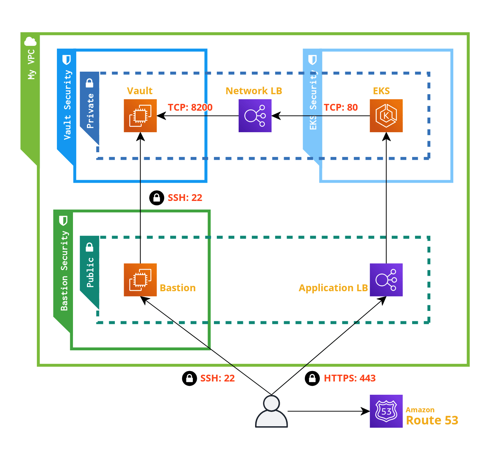

# Vault

- HashiCorp: [Vault](https://www.vaultproject.io/)
  - [Learn](https://learn.hashicorp.com/vault)
    - [Install](https://learn.hashicorp.com/tutorials/vault/getting-started-install?in=vault/getting-started)
  - [Documentation](https://www.vaultproject.io/docs)

## Prerequisites

- Helm 3.0+
- Kubernetes 1.9+

## Documentations

- [Install & Start](docs/start.vault.md): 
  - [Local VM Provision](local-vm/README.md): install vault in local vm
- Easy Tutorial: [Key Value Secrets](docs/kv.secrets.md)
- Install in [Local with Helm](local-helm/README.md): share kubernetes's token with pod
- Inject secrets via [sidecar](inject-secrets-via-sidecar/README.md): practice gradually
- External Vault: same as [Vault + Kubernetes](aws/07_vault-injector/README.md), [Cronjob Example](aws/08_example/README.md)
- Generate [PKI](docs/pki.md): with cert-manager
- [Password Rotation](docs/password.md): Rotate Linux User's Password
- [SSH OTP](docs/ssh.otp.md): One Time Password with SSH
- [AWS STS](docs/aws.iam.sts.md): AssumeRole, Federation Token
- [Database](database/README.md): Generates database credentials dynamically for the PostgreSQL
  - [Root Credential Rotation](database/README.md#root-credential-rotation)

## AWS EKS + Vault

[Quick Start](aws/README.md)

1. [Packer](aws/01_packer/README.md): AMI
1. [Resources](aws/02_resources/README.md): Subnets, Route, Load Balancer, Target Group, Route 53
1. [Terraform](aws/03_terraform/README.md): EC2
1. [Vault](aws/04_vault/README.md): Start a server
1. [Kubernetes](aws/05_kubernetes/vault.yaml): Deploy Service with externalName
1. [Vault Authenticationaws/](aws/06_admin/README.md): with AWS IAM
1. [Vault +aws/ Kubernetes](aws/07_vault-injector/README.md): Vault Injector
1. [Example](aws/08_example/README.md): Inject Vault Token

### Architecture

